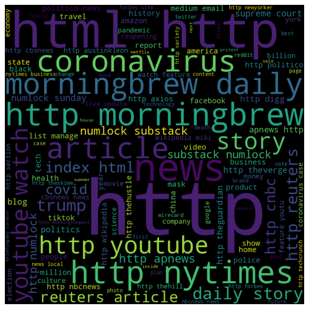

# Natural Language

This project serves as an illustrative demonstration of utilizing a Natural Language Processing (NLP) model for the purpose of discerning the spam classification of a webpage. Leveraging advanced machine learning techniques, particularly within the domain of NLP, we aim to assess the legitimacy of a webpage by analyzing patterns and linguistic features embedded in its URL.

## Content

- [Usage](#usage)
- [Examples](#examples)
- [Project Structure](#project-structure)
- [Contribution](#contribution)

## Usage

Enter in `src` and explore the diferents notebooks 

## Examples

Wordcloud generated by Python script

## Project Structure

- `models/`: Stores the trained model (if applicable).
- `data/`: Directory to store the training and testing datasets.
- `src/`: Contains the source code for the project.
- `docs/`: Documentation files for the project.
- `README.md`: Project documentation.

## Contribution

Contributions are welcome! If you find any issues or have improvements, please open an issue or submit a pull request.

